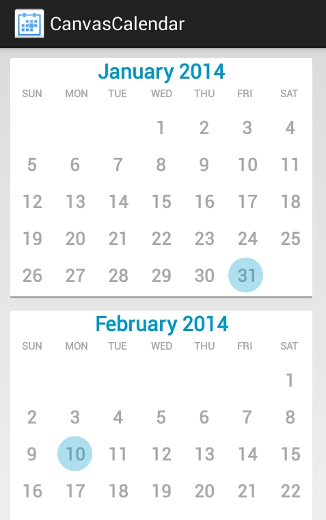

 A light-weight calendar month view. Implemented as a single view drawn on a canvas - to be as light as possible and friendly for adapter integration.
===================

Required min API level 1
-------------------------

USAGE
------
    // April 2014
    CanvasCalendarMonthView canvasMonthView = new CanvasCalendarMonthView(this, 3, 2014);

    // A nice background
    canvasMonthView.setBackgroundResource(R.drawable.month_bg);

    // Vibrate on day selection.
    canvasMonthView.setVibrateOnDaySelected(true);

    // Set a listener for day selection.
    canvasMonthView.setOnDaySelectedListener(this);

For a working example, please browse the **src** directory in this repository, and look for UsageExampleActivity.java

AUTHOR
-------

**Rany Albeg Wein**

TODO
-----

- Add strech-to-fit functionality to fit the width of the screen while maintaining proportions between the text size and the padding.
- Add an attrs.xml file and a CanvasCalendarMonthView(Context context, AttributeSet attrs) constructor.

LICENSE
--------

Copyright 2014 Rany Albeg Wein

Licensed under the Apache License, Version 2.0 (the "License");
you may not use this file except in compliance with the License.
You may obtain a copy of the License at

    http://www.apache.org/licenses/LICENSE-2.0

Unless required by applicable law or agreed to in writing, software
distributed under the License is distributed on an "AS IS" BASIS,
WITHOUT WARRANTIES OR CONDITIONS OF ANY KIND, either express or implied.
See the License for the specific language governing permissions and
limitations under the License.

